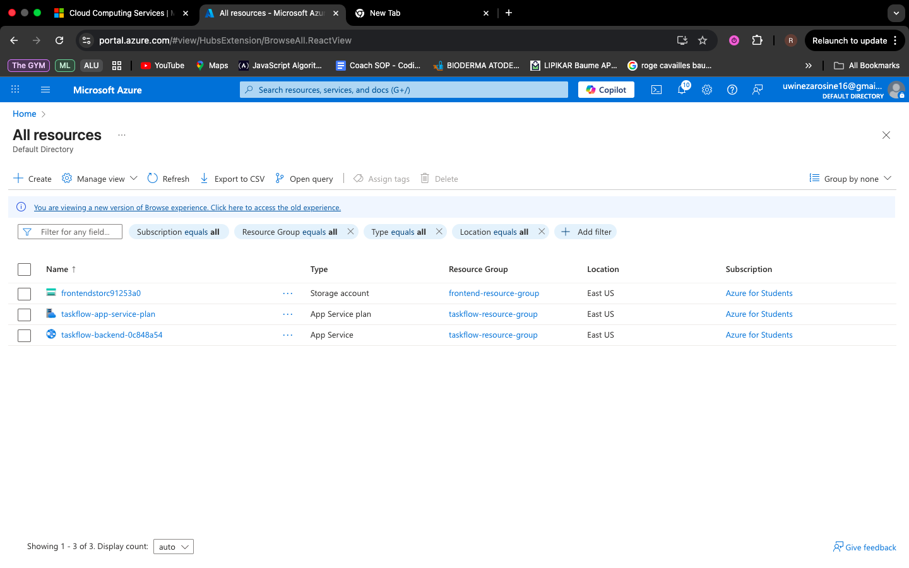
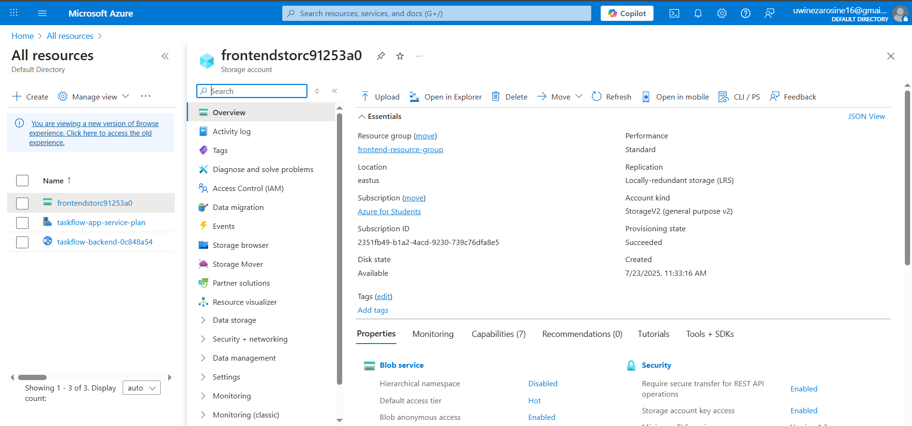
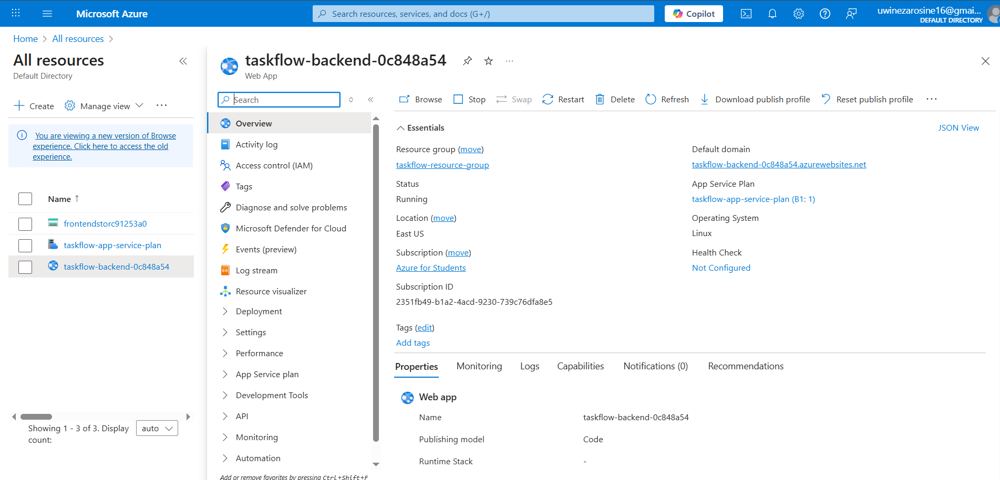

# Phase 2: IaC, Containerization & Manual Deployment Submission

## Live Public URL

[link text](https://frontendstorc91253a0.z13.web.core.windows.net/)

## Screenshots of Successfully Provisioned Resources

Here are screenshots of my deployed Azure resource:

## A link to the Pull Request you reviewed for your peer

[link text](https://github.com/Rosine22/TaskFlow-DevOps/pull/16/)

## A brief reflection on the challenges of IaC and the manual deployment process

- *What was difficult?*
  - Setting up Terraform and dealing with Azure subscription issues.
  - Understanding how to structure Terraform files correctly for Azure services.
  - Refactoring JWT authentication logic after removing protect, which caused backend issues.
  - Debugging ES module import/export errors in Node.js.
  - Handling missing backend dependencies during Docker builds (bcryptjs, jsonwebtoken, etc.).
  - Ensuring frontend-backend communication worked with correct environment variables in Docker Compose.

- *What did you learn?*
  - How to properly structure and troubleshoot Terraform scripts.
  - The importance of correct syntax and export handling in Node.js modules.
  - The benefits of Docker for consistent environments and easier debugging.
  - How multi-stage Docker builds create good images.
  - Why testing incrementally avoids bigger problems later.
